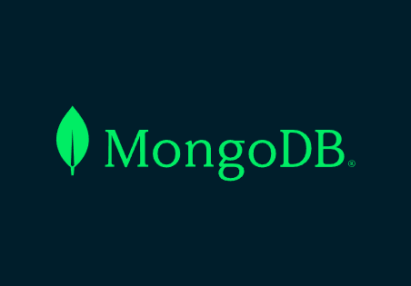
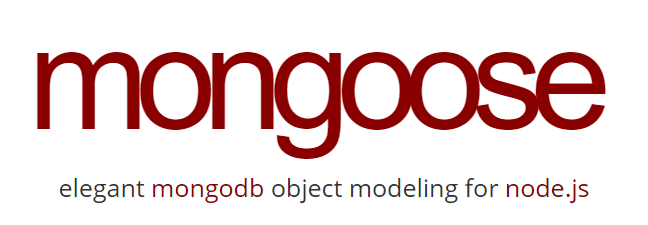
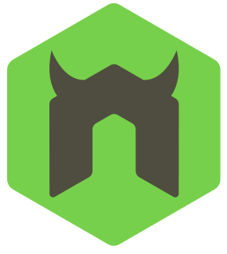

# Silly Mongoose
Social network API using NoSQL and MongoDB

 

## Description
Silly Mongoose is the back-end database management system for a social networking application. It utilizes NoSQL and MongoDB to ____.

## Table of Contents

- [Installation](#installation)
- [Usage](#usage)
- [Demo](#demo)
- [Technology Stack](#technology-stack)
- [Credits](#credits)
- [License](#license)
- [Contact](#contact)

## Installation

This application does not have a UI so all interactions will take place in the command line and in Insomnia (or other desktop framework for testing RESTful applications). 
1. Clone the GitHub repository to your local environment using the provided SSH key.

        git clone git@github.com:SunnyOhK/silly-mongoose.git

2. From your command line:
    - Insure that all node packages have been installed

          /silly-mongoose
              npm i
    - Seed the database from the utils folder
    
          /silly-mongoose/utils
              node seed.js
            
    - Initiate the MongoDB server from the root folder

          /silly-mongoose
              node index.js  <--OR-->  nodemon index.js

3. In your Insomnia dashboard, you can test all GET, POST, PUT, and DEL routes using the following URL and the following subdirectories:

|  | URL Paths |  | 
| ---- | --- | --- | 
| . . . . . . . . . . . . | http://localhost:3001/api | . . . . . . . . . . . . | 
| USERS | THOUGHTS |  |
| /users | /thoughts |  |
| /users/:id | /thoughts/:id | /:id |

The demo video (below) will take you step-by-step through the following inquiries:
1. GET - (find) all users, single user by ID, all thoughts, single thought by ID 
2. POST - (create) new user, new thought, new reaction to a thought, and (add) new friend
3. PUT - (update) single user by ID, single thought by ID, single reaction by ID
4. DEL - (delete) single user by ID, single thought by ID, single reaction by ID, (remove) friend by ID

## Usage 

After you clone the repository and install the node modules, please follow this video tutorial for simple step-by-step instructions:

### Demo:

🎬 Or you can view the video at: [Screencastify]()

## Technology Stack

|  | Tech Stack | Description |
| ---- | --- | --- |
| Foundation |  |  |
|  | JavaScript | Scripting language for webpages |
|  | MongoDB | Cross-platform document-oriented database program |
|  | Node.js | Javascript Framework |
| Testing |  |  |
|  | Insomnia REST | Collaborative open source API development platform |
| npm Packages |  |  |
|  | mongoose | MongoDB object modeling for Node.js |
|  | Nodemon | Utility to monitor code changes and restart server |
|  | Express | Node.js module |
|  | Moment.js | Date &time display for JavaScript |

## Credits

- Alex Gonzalez: EdX Tutor - .

## License
This project is licensed under: [MIT](https://choosealicense.com/licenses/mit/)
 

## Contact

For questions, please contact me:

### GitHub: 
  &nbsp;&nbsp;&nbsp; [SunnyOhK](https://github.com/SunnyOhK)
### Project Link: 
  &nbsp;&nbsp;&nbsp; https://github.com/SunnyOhK/silly-mongoose
### Email: 
  &nbsp;&nbsp;&nbsp; 127900916+SunnyOhK@users.noreply.github.com
